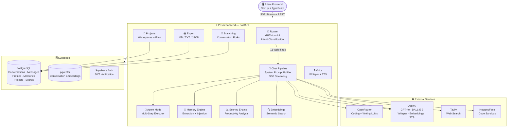
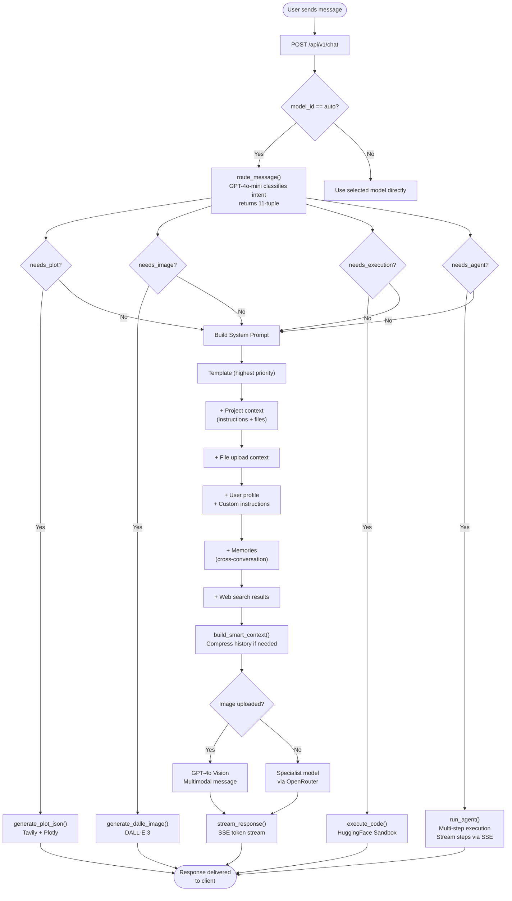
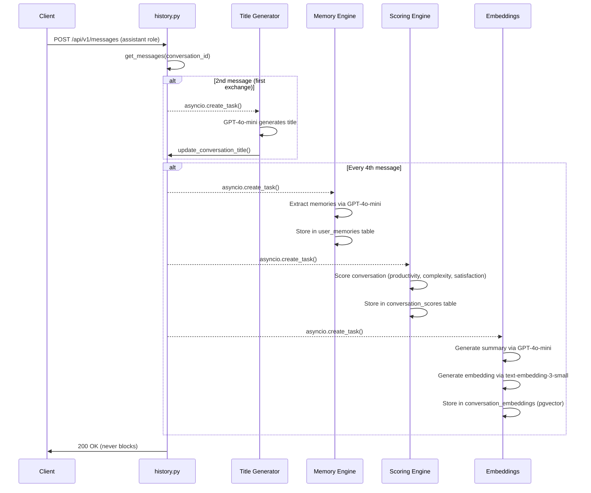
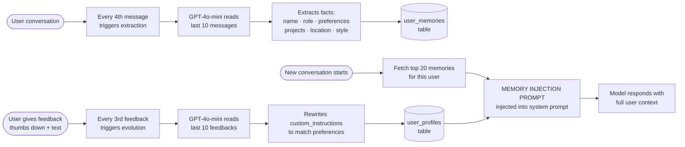
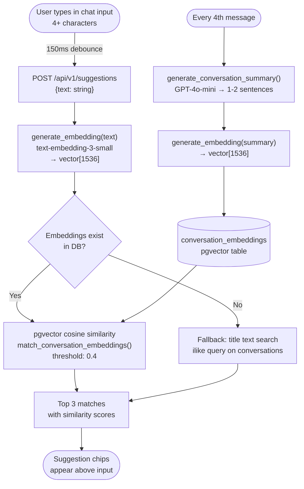
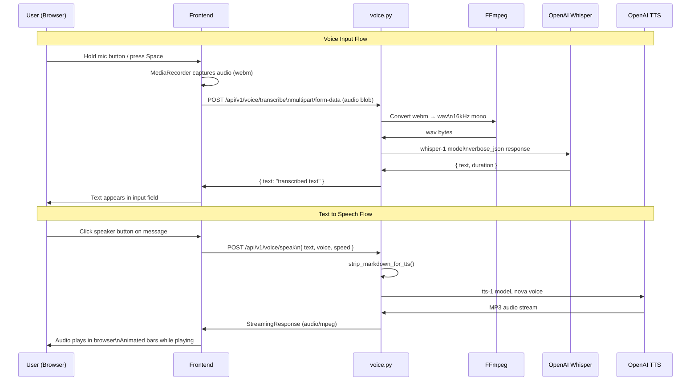
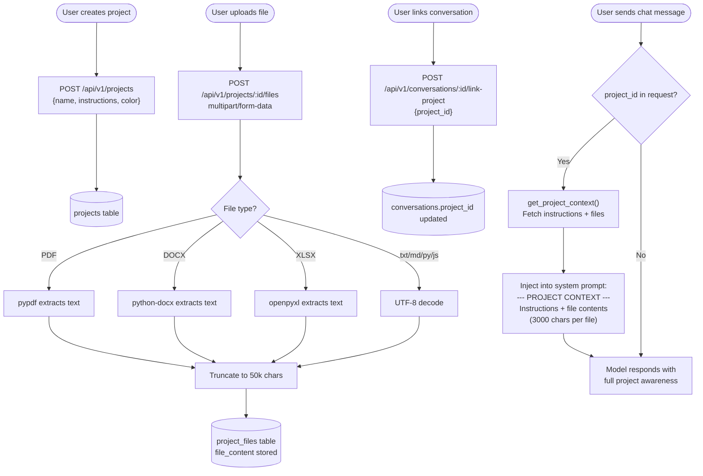
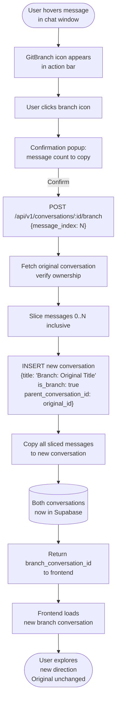
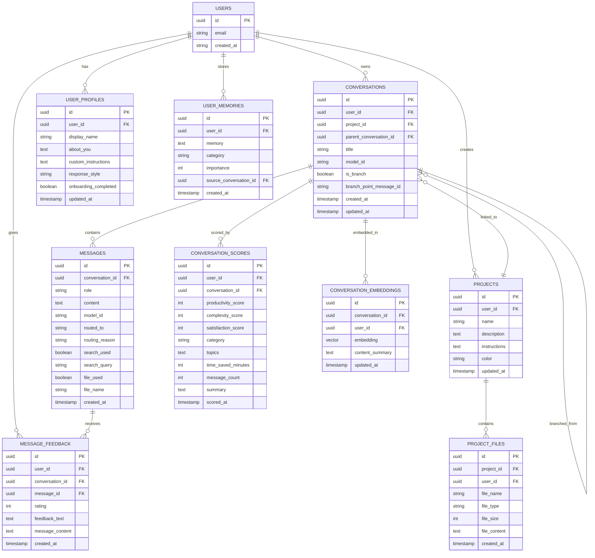

# Prism Backend

> The intelligent routing engine powering Prism — an AI copilot that sends every message to the right model.


---

## What is Prism?

Prism is an open-source AI copilot that routes every user message to the most capable specialist model. Instead of sending every question to the same general-purpose LLM, Prism reads what you are asking, decides what kind of help you need, and picks the best model for that specific task — automatically, in real time.

It also learns who you are. Prism extracts memories from your conversations, adapts to your feedback, and builds a profile of your preferences over time. The more you use it, the better it gets.

**The right model. Every time.**

---

## System Architecture



---

## Chat Request Flow



---

## Background Task Pipeline



---

## Memory and Personalization Flow



---

## Smart Suggestions Data Flow



---

## Voice Pipeline



---

## Project Workspace Flow



---

## Conversation Branching Flow



---

## Database Schema



---

## Features

### Core
- **Auto Model Routing** — Classifies every message and routes to the best specialist model
- **Web Search Integration** — Detects when real-time information is needed, fetches via Tavily
- **AI Image Generation** — Creates images via DALL-E 3 from natural language prompts
- **Data Visualization** — Generates interactive Plotly JSON charts from descriptions
- **Code Execution** — Runs Python, JavaScript, TypeScript, and Bash in a sandboxed environment
- **Multi-Step Agent Mode** — Breaks complex tasks into steps and executes them sequentially
- **File Upload and Parsing** — Supports PDF, DOCX, CSV, XLSX, and common code files
- **GPT-4o Vision** — Analyzes images uploaded by the user

### Voice
- **Voice Transcription** — Records audio via MediaRecorder, converts via FFmpeg, transcribes via Whisper
- **Text to Speech** — Converts any response to audio using OpenAI TTS with six premium voices
- **FFmpeg Conversion** — webm/ogg audio converted to 16kHz WAV for optimal Whisper accuracy

### Intelligence
- **Cross-Conversation Memory** — Extracts and injects memories across all user sessions
- **Smart Context Compression** — Summarizes old messages to stay within token limits
- **Prompt Template Library** — Six built-in templates triggered via slash commands
- **Feedback Evolution** — Learns from thumbs up and down to rewrite custom instructions
- **Smart Context Suggestions** — Semantic similarity search using OpenAI embeddings and pgvector
- **Conversation Scoring** — Automatically scores productivity, complexity, and satisfaction per conversation

### Projects
- **Project Workspaces** — Users create projects with custom instructions and uploaded files
- **File Context Injection** — Project file contents are injected into the system prompt automatically
- **Conversation Linking** — Any conversation can be linked to a project
- **Storage Limits** — 5MB per file, 25MB per project, 100MB per user

### Conversations
- **Export** — Download any conversation as Markdown, plain text, or JSON
- **Branching** — Fork any conversation from any message point, original stays intact
- **Search** — Full-text search across titles and message content with snippet extraction
- **Auto Title** — GPT-4o-mini generates a specific title after the first exchange

### Infrastructure
- **Supabase Auth** — JWT verification, per-user data isolation
- **Persistent Storage** — All conversations, messages, memories, scores in Supabase PostgreSQL
- **Streaming SSE** — All responses stream token by token via Server-Sent Events
- **Background Tasks** — Memory extraction, scoring, and embedding run asynchronously
- **Docker Ready** — Single command to run the full backend locally

---

## API Endpoints

### Chat
| Method | Endpoint | Description |
|--------|----------|-------------|
| `POST` | `/api/v1/chat` | Send a message, stream a response with routing metadata |
| `GET` | `/api/v1/models` | List all available specialist models |

### Files
| Method | Endpoint | Description |
|--------|----------|-------------|
| `POST` | `/api/v1/file/parse` | Upload and parse a file |

### Conversations
| Method | Endpoint | Description |
|--------|----------|-------------|
| `POST` | `/api/v1/conversations` | Create a new conversation |
| `GET` | `/api/v1/conversations` | List all conversations for the user |
| `GET` | `/api/v1/conversations/:id` | Get a single conversation |
| `GET` | `/api/v1/conversations/:id/messages` | Get all messages in a conversation |
| `DELETE` | `/api/v1/conversations/:id` | Delete a conversation |
| `POST` | `/api/v1/messages` | Save a message to a conversation |
| `GET` | `/api/v1/search?q=query` | Search conversations and message content |
| `GET` | `/api/v1/conversations/:id/export?format=md\|txt\|json` | Export a conversation |
| `POST` | `/api/v1/conversations/:id/branch` | Branch a conversation from a message index |
| `GET` | `/api/v1/conversations/:id/branches` | Get all branches of a conversation |

### Voice
| Method | Endpoint | Description |
|--------|----------|-------------|
| `POST` | `/api/v1/voice/transcribe` | Transcribe audio via Whisper (multipart/form-data) |
| `POST` | `/api/v1/voice/speak` | Convert text to speech, returns MP3 stream |
| `GET` | `/api/v1/voice/voices` | List available TTS voices with descriptions |

### Profile and Memory
| Method | Endpoint | Description |
|--------|----------|-------------|
| `GET` | `/api/v1/profile` | Get user profile |
| `POST` | `/api/v1/profile` | Create or update user profile |
| `POST` | `/api/v1/profile/complete-onboarding` | Mark onboarding as complete |
| `GET` | `/api/v1/memories` | Get all memories for the user |
| `DELETE` | `/api/v1/memories` | Delete all memories |
| `POST` | `/api/v1/memories/extract` | Manually trigger memory extraction |

### Projects
| Method | Endpoint | Description |
|--------|----------|-------------|
| `GET` | `/api/v1/projects` | List all projects |
| `POST` | `/api/v1/projects` | Create a new project |
| `GET` | `/api/v1/projects/:id` | Get project with files |
| `PATCH` | `/api/v1/projects/:id` | Update project details |
| `DELETE` | `/api/v1/projects/:id` | Delete project and all its files |
| `POST` | `/api/v1/projects/:id/files` | Upload a file to a project |
| `GET` | `/api/v1/projects/:id/files` | List files in a project |
| `DELETE` | `/api/v1/projects/:id/files/:file_id` | Delete a project file |
| `POST` | `/api/v1/conversations/:id/link-project` | Link a conversation to a project |
| `GET` | `/api/v1/projects/:id/conversations` | Get conversations linked to a project |

### Feedback and Scores
| Method | Endpoint | Description |
|--------|----------|-------------|
| `POST` | `/api/v1/feedback` | Submit message feedback |
| `GET` | `/api/v1/feedback/stats` | Get feedback statistics |
| `GET` | `/api/v1/scores/summary` | Get productivity dashboard summary |
| `GET` | `/api/v1/scores/recent` | Get recent conversation scores |
| `GET` | `/api/v1/scores/conversation/:id` | Get score for a specific conversation |

### Suggestions
| Method | Endpoint | Description |
|--------|----------|-------------|
| `POST` | `/api/v1/suggestions` | Get smart context suggestions while typing |
| `POST` | `/api/v1/suggestions/embed-all` | Bulk embed all conversations |
| `POST` | `/api/v1/suggestions/embed-conversation` | Embed a single conversation |

### Sandbox
| Method | Endpoint | Description |
|--------|----------|-------------|
| `POST` | `/api/v1/sandbox/execute` | Execute code in the sandbox |

### Templates
| Method | Endpoint | Description |
|--------|----------|-------------|
| `GET` | `/api/v1/templates` | List all prompt templates |
| `GET` | `/api/v1/templates/:id` | Get a specific template |

### Demo
| Method | Endpoint | Description |
|--------|----------|-------------|
| `POST` | `/api/v1/demo/chat` | Public demo endpoint, no auth, rate limited |
| `GET` | `/api/v1/demo/status` | Check demo usage for current IP |

---

## Chat Request and Response

### Request
```json
{
  "message": "write a binary search in Python",
  "model_id": "auto",
  "conversation_history": [
    { "role": "user", "content": "..." },
    { "role": "assistant", "content": "..." }
  ],
  "user_id": "uuid",
  "file_name": "data.csv",
  "file_type": "csv",
  "file_content": "...",
  "image_base64": "...",
  "image_media_type": "image/jpeg",
  "active_template": "code-review",
  "project_id": "uuid"
}
```

`model_id` can be `"auto"`, `"coding"`, or `"writing"`.

### SSE Event Types
```
metadata         — routing info, model name, flags
token            — streaming text chunk
agent_plan       — list of step titles and total count
agent_step_start — step number and title
agent_step_done  — step completed
done             — stream complete
error            — error message
```

### Metadata Event
```json
{
  "type": "metadata",
  "model_name": "Coding Assistant",
  "model_id": "coding",
  "routed_to": "coding",
  "routing_reason": "The request involves code generation.",
  "search_used": false,
  "file_used": false,
  "image_used": false,
  "is_agent": false,
  "active_template": null,
  "project_id": null
}
```

---

## Getting Started

### Prerequisites
- Docker and Docker Compose
- OpenRouter API key (free at [openrouter.ai](https://openrouter.ai))
- OpenAI API key (for DALL-E 3, Whisper, TTS, and embeddings)
- Tavily API key (free at [tavily.com](https://tavily.com))
- Supabase project (free at [supabase.com](https://supabase.com))

### 1. Clone the repository
```bash
git clone https://github.com/NorthCommits/Prism-backend.git
cd Prism-backend
```

### 2. Set up environment variables
```bash
cp .env.example .env
```

Edit `.env` with your keys:
```dotenv
OPENROUTER_API_KEY=your_openrouter_api_key
OPENAI_API_KEY=your_openai_api_key
TAVILY_API_KEY=your_tavily_api_key
SUPABASE_URL=https://your-project.supabase.co
SUPABASE_KEY=your_supabase_service_role_key
SANDBOX_URL=https://your-sandbox.hf.space
```

### 3. Set up Supabase database

Run the following SQL in your Supabase SQL editor:

```sql
-- Core tables
CREATE TABLE conversations (
  id UUID PRIMARY KEY DEFAULT gen_random_uuid(),
  title TEXT NOT NULL,
  model_id TEXT NOT NULL DEFAULT 'auto',
  user_id UUID REFERENCES auth.users(id) ON DELETE CASCADE,
  project_id UUID,
  parent_conversation_id UUID REFERENCES conversations(id) ON DELETE SET NULL,
  branch_point_message_id TEXT,
  is_branch BOOLEAN DEFAULT FALSE,
  created_at TIMESTAMPTZ DEFAULT NOW(),
  updated_at TIMESTAMPTZ DEFAULT NOW()
);

CREATE TABLE messages (
  id UUID PRIMARY KEY DEFAULT gen_random_uuid(),
  conversation_id UUID REFERENCES conversations(id) ON DELETE CASCADE,
  role TEXT NOT NULL CHECK (role IN ('user', 'assistant')),
  content TEXT NOT NULL,
  model_id TEXT,
  routed_to TEXT,
  routing_reason TEXT,
  search_used BOOLEAN DEFAULT FALSE,
  search_query TEXT,
  file_used BOOLEAN DEFAULT FALSE,
  file_name TEXT,
  created_at TIMESTAMPTZ DEFAULT NOW()
);

CREATE TABLE user_profiles (
  id UUID PRIMARY KEY DEFAULT gen_random_uuid(),
  user_id UUID UNIQUE REFERENCES auth.users(id) ON DELETE CASCADE,
  display_name TEXT,
  about_you TEXT,
  custom_instructions TEXT,
  response_style TEXT DEFAULT 'balanced',
  onboarding_completed BOOLEAN DEFAULT FALSE,
  created_at TIMESTAMPTZ DEFAULT NOW(),
  updated_at TIMESTAMPTZ DEFAULT NOW()
);

CREATE TABLE user_memories (
  id UUID PRIMARY KEY DEFAULT gen_random_uuid(),
  user_id UUID REFERENCES auth.users(id) ON DELETE CASCADE,
  memory TEXT NOT NULL,
  category TEXT,
  importance INTEGER CHECK (importance BETWEEN 1 AND 5),
  source_conversation_id UUID,
  created_at TIMESTAMPTZ DEFAULT NOW(),
  updated_at TIMESTAMPTZ DEFAULT NOW()
);

CREATE TABLE projects (
  id UUID PRIMARY KEY DEFAULT gen_random_uuid(),
  user_id UUID REFERENCES auth.users(id) ON DELETE CASCADE,
  name TEXT NOT NULL,
  description TEXT,
  instructions TEXT,
  color TEXT DEFAULT '#8b5cf6',
  created_at TIMESTAMPTZ DEFAULT NOW(),
  updated_at TIMESTAMPTZ DEFAULT NOW()
);

CREATE TABLE project_files (
  id UUID PRIMARY KEY DEFAULT gen_random_uuid(),
  project_id UUID REFERENCES projects(id) ON DELETE CASCADE,
  user_id UUID REFERENCES auth.users(id) ON DELETE CASCADE,
  file_name TEXT NOT NULL,
  file_type TEXT NOT NULL,
  file_size INTEGER NOT NULL,
  file_content TEXT,
  created_at TIMESTAMPTZ DEFAULT NOW()
);

CREATE TABLE message_feedback (
  id UUID PRIMARY KEY DEFAULT gen_random_uuid(),
  user_id UUID REFERENCES auth.users(id) ON DELETE CASCADE,
  conversation_id UUID REFERENCES conversations(id) ON DELETE CASCADE,
  message_id UUID,
  rating INTEGER CHECK (rating IN (1, -1)),
  feedback_text TEXT,
  message_content TEXT,
  created_at TIMESTAMPTZ DEFAULT NOW()
);

CREATE TABLE conversation_scores (
  id UUID PRIMARY KEY DEFAULT gen_random_uuid(),
  user_id UUID REFERENCES auth.users(id) ON DELETE CASCADE,
  conversation_id UUID REFERENCES conversations(id) ON DELETE CASCADE,
  productivity_score INTEGER CHECK (productivity_score BETWEEN 1 AND 10),
  complexity_score INTEGER CHECK (complexity_score BETWEEN 1 AND 10),
  satisfaction_score INTEGER CHECK (satisfaction_score BETWEEN 1 AND 10),
  category TEXT DEFAULT 'general',
  topics TEXT[],
  time_saved_minutes INTEGER DEFAULT 0,
  message_count INTEGER DEFAULT 0,
  summary TEXT,
  scored_at TIMESTAMPTZ DEFAULT NOW(),
  created_at TIMESTAMPTZ DEFAULT NOW()
);

CREATE EXTENSION IF NOT EXISTS vector;

CREATE TABLE conversation_embeddings (
  id UUID PRIMARY KEY DEFAULT gen_random_uuid(),
  conversation_id UUID REFERENCES conversations(id) ON DELETE CASCADE,
  user_id UUID REFERENCES auth.users(id) ON DELETE CASCADE,
  embedding vector(1536),
  content_summary TEXT,
  created_at TIMESTAMPTZ DEFAULT NOW(),
  updated_at TIMESTAMPTZ DEFAULT NOW()
);

CREATE INDEX idx_messages_conversation_id ON messages(conversation_id);
CREATE INDEX idx_conversations_user_id ON conversations(user_id);
CREATE INDEX idx_conversations_project_id ON conversations(project_id);
CREATE INDEX idx_conversations_parent_id ON conversations(parent_conversation_id);
CREATE INDEX idx_projects_user_id ON projects(user_id);
CREATE INDEX idx_project_files_project_id ON project_files(project_id);
CREATE INDEX idx_conversation_scores_user_id ON conversation_scores(user_id);
CREATE INDEX idx_conversation_embeddings_user_id ON conversation_embeddings(user_id);
CREATE INDEX idx_conversation_embeddings_vector
  ON conversation_embeddings
  USING ivfflat (embedding vector_cosine_ops)
  WITH (lists = 100);

CREATE OR REPLACE FUNCTION match_conversation_embeddings(
  query_embedding vector(1536),
  match_user_id UUID,
  match_threshold float DEFAULT 0.4,
  match_count int DEFAULT 3
)
RETURNS TABLE (
  conversation_id UUID,
  content_summary TEXT,
  similarity float
)
LANGUAGE plpgsql AS $$
BEGIN
  RETURN QUERY
  SELECT
    ce.conversation_id,
    ce.content_summary,
    1 - (ce.embedding <=> query_embedding) AS similarity
  FROM conversation_embeddings ce
  WHERE ce.user_id = match_user_id
    AND 1 - (ce.embedding <=> query_embedding) > match_threshold
  ORDER BY ce.embedding <=> query_embedding
  LIMIT match_count;
END;
$$;
```

### 4. Run with Docker
```bash
docker-compose up --build
```

The API will be available at `http://localhost:8000`.

### 5. Explore the API docs
Visit `http://localhost:8000/docs` for the interactive Swagger UI.

---

## Project Structure

```
Prism-backend/
├── main.py                    # FastAPI app entry point, all routers registered
├── requirements.txt           # Python dependencies
├── Dockerfile                 # Includes FFmpeg for audio conversion
├── docker-compose.yml
├── .env                       # Environment variables (never commit this)
├── models/
│   ├── config.py              # Model registry
│   └── router_config.py       # Router system prompt
├── routes/
│   ├── chat.py                # Main chat endpoint, full routing pipeline
│   ├── router.py              # Intent classification, returns 11-tuple
│   ├── search.py              # Tavily web search
│   ├── image.py               # DALL-E 3 and Plotly JSON generation
│   ├── sandbox.py             # Code execution via HuggingFace sandbox
│   ├── file.py                # File parsing
│   ├── history.py             # Conversation CRUD, search, export, branching
│   ├── profile.py             # User profile and custom instructions
│   ├── memory.py              # Cross-conversation memory extraction
│   ├── agent.py               # Multi-step agent planner and executor
│   ├── templates.py           # Prompt template library
│   ├── feedback.py            # Message feedback and prompt evolution
│   ├── scores.py              # Conversation productivity scoring
│   ├── suggestions.py         # Smart context suggestions via embeddings
│   ├── projects.py            # Project workspaces and file management
│   ├── voice.py               # Whisper transcription and OpenAI TTS
│   └── demo.py                # Public demo endpoint
└── db/
    ├── supabase.py            # Supabase client singleton
    ├── auth.py                # JWT token verification
    ├── conversations.py       # Conversation DB operations
    └── messages.py            # Message DB operations
```

---

## Adding a New Specialist Model

Adding a new model takes less than a minute. Open `models/config.py` and add an entry:

```python
"summarization": ModelConfig(
    name="Summarization Assistant",
    description="Specialized for summarizing long documents.",
    openrouter_model="openai/gpt-4o-mini",
    system_prompt="You are an expert at summarizing content concisely..."
)
```

The router will automatically start sending relevant queries to it.

---

## Background Tasks

Several features run silently in the background after every assistant message:

| Task | Trigger | What it does |
|------|---------|--------------|
| Auto Title | 2nd message | Generates a specific conversation title via GPT-4o-mini |
| Memory Extraction | Every 4th message | Extracts facts about the user and stores them |
| Conversation Scoring | Every 4th message | Scores productivity, complexity, and satisfaction |
| Embedding Storage | Every 4th message | Generates and stores a vector embedding for suggestions |

All tasks use `asyncio.create_task` so they never block the response stream.

---

## Environment Variables

| Variable | Description | Required |
|----------|-------------|----------|
| `OPENROUTER_API_KEY` | OpenRouter API key for model access | Yes |
| `OPENAI_API_KEY` | OpenAI API key for DALL-E 3, Whisper, TTS, embeddings | Yes |
| `TAVILY_API_KEY` | Tavily API key for web search | Yes |
| `SUPABASE_URL` | Your Supabase project URL | Yes |
| `SUPABASE_KEY` | Supabase service role key | Yes |
| `SANDBOX_URL` | HuggingFace sandbox URL for code execution | Yes |

---

## Tech Stack

| Technology | Purpose |
|------------|---------|
| **FastAPI** | High-performance async API framework |
| **OpenRouter** | Unified API gateway for LLMs |
| **GPT-4o-mini** | Intent classification, routing, scoring, titles, memory extraction |
| **GPT-4o** | Vision analysis for uploaded images |
| **DALL-E 3** | AI image generation |
| **Whisper** | Speech to text transcription |
| **OpenAI TTS** | Text to speech with six premium voices |
| **text-embedding-3-small** | Conversation embeddings for smart suggestions |
| **Tavily** | Real-time web search |
| **Plotly** | Interactive data visualization |
| **FFmpeg** | Audio format conversion (webm to wav) |
| **Supabase** | PostgreSQL database and authentication |
| **pgvector** | Vector similarity search for suggestions |
| **Docker** | Containerization |
| **HuggingFace Spaces** | Sandboxed code execution |

---

## Contributing

Contributions are welcome. Please feel free to open an issue or submit a pull request.

1. Fork the repository
2. Create your feature branch (`git checkout -b feat/amazing-feature`)
3. Commit your changes (`git commit -m 'feat: add amazing feature'`)
4. Push to the branch (`git push origin feat/amazing-feature`)
5. Open a Pull Request

---

## License

MIT License — free to use in your own projects.

---

<p align="center">Built by <a href="https://github.com/NorthCommits">NorthCommits</a></p>